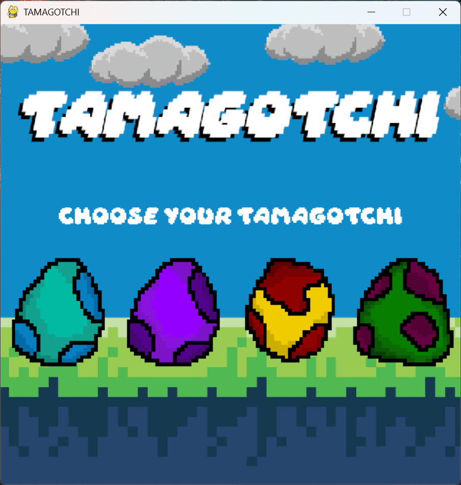
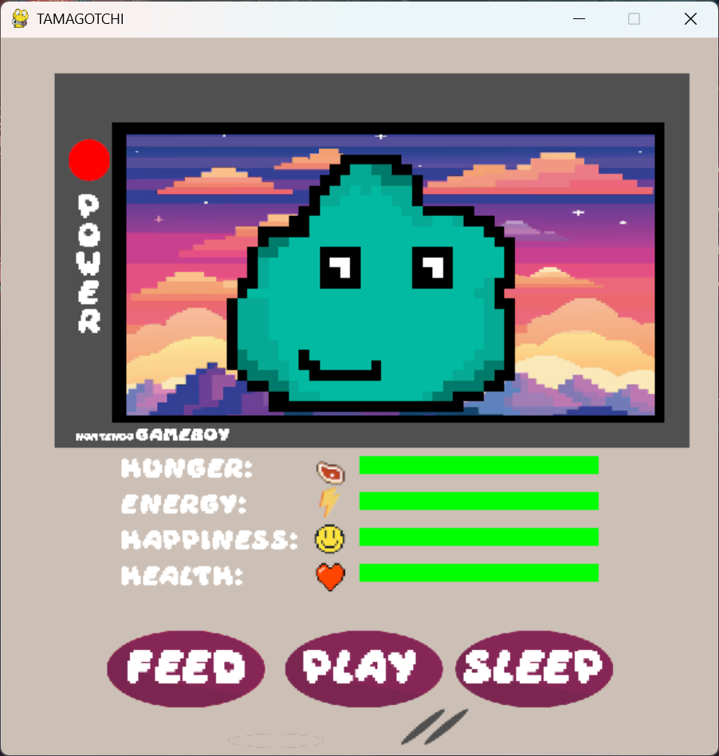
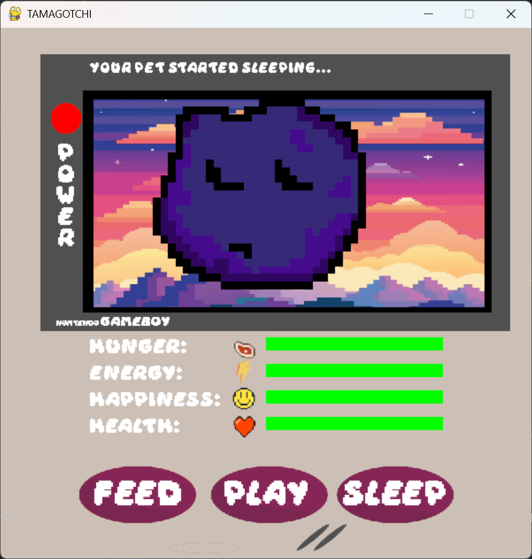

# PPY_Tamagotchi_Projekt_s30781
Oto mój projekt na przedmiot PPY. Tematem mojej pracy była gra tamagotchi.

Polecenie:
Napisz skrypt będący Grą symulacyjną zwierzątko. Gra przeznaczona jest dla 1 gracza.
Wykorzystaj nabytą wiedzę z zajęć. Kod powinien być napisany zgodnie z standardami
i praktykami dobrego programowania. Przygotuj automatycznie wygenerowaną
dokumentację w formacie pdf. Całość umieść na GitHub.
Wymagania:
  -Interfejs GUI
  -Wybór zwierzaka spośród przynajmniej 4 opcji
  -Ustalanie ilości pożywienia
  -Ustalenie czasu poświęconego na zabawę
  -Wartości poziomu głodu oraz nudy u zwierzaka powinny się zmieniać wraz z podaniem pożywienia czy zabawą

Poniżej zamieszcam zdjęcia z apliakcji (grafika komputerowa nie jest moja mocną stroną więc dlatego jest takie "graphic design is my passion"). Niemniej jednak licze że projekt sie spodoba

Menu główne gry:

Ekran do wyboru jajka naszego zwierzaka:

Przykładowy screenshot pokazujący rozgrywkę:

Ćśś fioletowy stworek teraz śpi:

